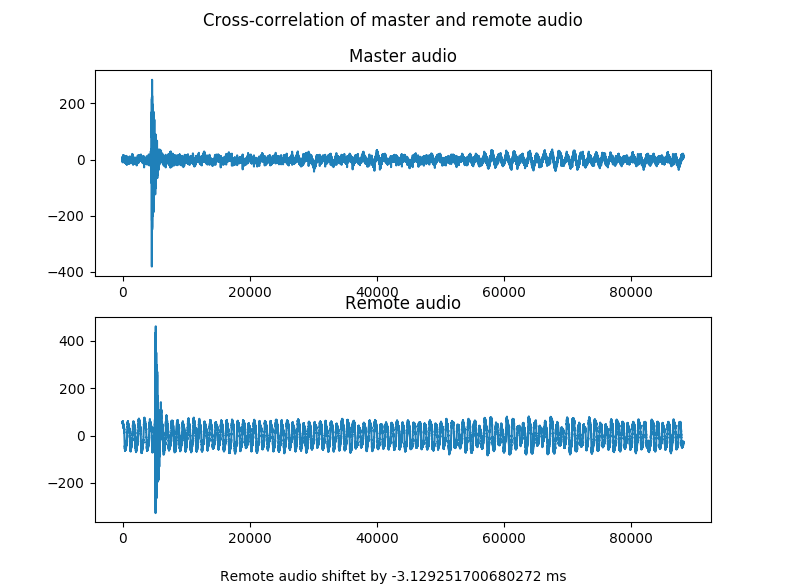

# Measure shift between two audio sources via cross-correlation

Sound recording devices are synchronized via PTP (precision timing protocol). Implementaions
available for PTP: ptpd, linuxptp. Accuracy of time with PTP is \< 1ms. 

A small [python programm](python/client.py) requests recordings from synchronized devices
with a starting time slighty in the future, plenty time to cope with network latencies.
The received recordings get cross-correlated. 

## How to start measurement

- run a PTP server in local network
- run PTP slaves (ptpd) on recording devices
- start docker container for recording on devices

    docker run --device=/dev/snd -p 10010:10010 --env ALSA_DEVICE=hw:1,0 rhocheck/soundcapture
- run [python program](python/client.py)